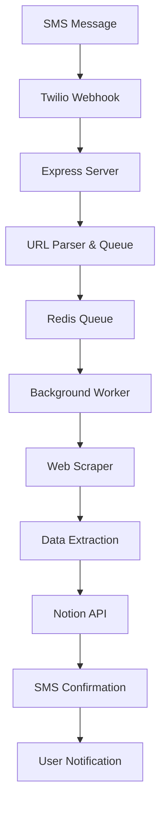

# Technical Co-Founder Walkthrough
*SMS-to-Notion Lead Enrichment System*

## 🎯 Business Problem & Solution

### The Problem
Manual lead entry and enrichment is time-consuming and error-prone. Sales teams waste hours:
- Copying URLs between systems
- Manually researching prospects
- Inconsistent data entry
- Missing follow-up opportunities

### Our Solution
**SMS-powered lead capture** that instantly enriches data:
1. Text a URL → Get enriched lead data
2. Zero manual data entry
3. Consistent, structured information
4. Real-time processing with notifications

### Market Opportunity
- **TAM**: $50B+ CRM/Sales tools market
- **Target Users**: Sales teams, agencies, consultants, recruiters
- **Value Prop**: Save 2-3 hours/day on lead research
- **Pricing**: $29-99/user/month (based on usage)

---

## 🏗️ Technical Architecture Deep Dive

### System Components



### Technology Stack Rationale

**Node.js + Express**: 
- ✅ Great for I/O heavy operations (webhooks, API calls)
- ✅ Excellent npm ecosystem for web scraping
- ✅ Easy deployment and scaling
- ❌ CPU intensive tasks (but we can offload those)

**Twilio SMS**:
- ✅ Reliable, global reach
- ✅ Easy integration and testing
- ✅ Reasonable pricing (~$0.0075/SMS)
- ❌ Vendor lock-in (but easily replaceable)

**Notion API**:
- ✅ Users already live in Notion
- ✅ Rich data types and formatting
- ✅ Built-in collaboration features
- ❌ Rate limits (but manageable for our use case)

**Redis + Bull Queue**:
- ✅ Reliable background processing
- ✅ Job retries and failure handling
- ✅ Horizontal scaling ready
- ❌ Additional infrastructure complexity

**Puppeteer + Cheerio**:
- ✅ Handles both static and dynamic content
- ✅ Can bypass basic anti-bot measures
- ❌ Resource intensive (but we queue this)
- ❌ May get blocked by sophisticated sites

---

## 💡 Technical Decisions & Trade-offs

### Queue System Choice
**Why Bull + Redis?**
- Background processing prevents webhook timeouts
- Reliable job processing with retries
- Horizontal scaling capability
- Rich monitoring and debugging

**Alternative considered**: Direct processing
- ❌ Would timeout on slow websites
- ❌ No retry mechanism for failures
- ❌ Poor user experience

### Web Scraping Strategy
**Why Puppeteer + Cheerio combo?**
- Cheerio for fast static content
- Puppeteer fallback for JS-heavy sites
- Best of both worlds approach

**Alternatives considered**:
- Pure Puppeteer: Too slow for simple sites
- Pure Cheerio: Misses JS-rendered content
- Third-party APIs: Expensive and limited

### Data Storage Choice
**Why Notion over database?**
- Users already use Notion for CRM
- Rich formatting and collaboration
- No additional database maintenance
- Built-in UI for data management

**Trade-offs**:
- ✅ User adoption easier
- ✅ No UI development needed
- ❌ Rate limiting concerns
- ❌ Limited query capabilities

---

## 🚀 Scaling Strategy

### Phase 1: MVP (Current)
- **Target**: 100 users, 1,000 URLs/day
- **Infrastructure**: Single server + Redis
- **Cost**: ~$50/month

### Phase 2: Growth (6 months)
- **Target**: 1,000 users, 10,000 URLs/day
- **Additions**: 
  - Load balancer
  - Multiple worker instances
  - Redis cluster
  - Monitoring dashboard
- **Cost**: ~$300/month

### Phase 3: Scale (12 months)
- **Target**: 10,000 users, 100,000 URLs/day
- **Additions**:
  - Microservices architecture
  - Dedicated scraping service
  - Proxy rotation service
  - Analytics platform
- **Cost**: ~$2,000/month

### Scaling Bottlenecks & Solutions

**1. Web Scraping Performance**
- Problem: Slow scraping blocks queue
- Solution: Dedicated scraping workers, proxy rotation
- Timeline: Month 3-4

**2. Notion Rate Limits**
- Problem: 3 requests/second limit
- Solution: Request batching, caching layer
- Timeline: Month 6-8

**3. SMS Costs**
- Problem: Linear cost growth with usage
- Solution: Tiered pricing, bulk SMS optimization
- Timeline: Month 9-12

---

## 🔒 Security & Compliance

### Current Security Measures
- ✅ Environment variable management
- ✅ HTTPS enforcement
- ✅ Input validation and sanitization
- ✅ Error handling without data leakage

### Production Security Additions
- **Rate limiting**: Prevent abuse and DoS
- **Phone number whitelist**: Control access
- **Data encryption**: Encrypt sensitive data at rest
- **Audit logging**: Track all system actions
- **GDPR compliance**: Data retention policies

### Compliance Considerations
- **GDPR**: Right to deletion, data portability
- **CCPA**: California privacy rights
- **SMS regulations**: TCPA compliance for US
- **Data retention**: Automatic cleanup policies

---

## 💰 Business Model & Unit Economics

### Revenue Model
**Freemium SaaS**:
- Free: 10 URLs/month
- Pro: $29/month (500 URLs)
- Team: $99/month (5000 URLs)
- Enterprise: Custom pricing

### Unit Economics (at scale)
```
Average Revenue Per User (ARPU): $45/month
Customer Acquisition Cost (CAC): $135
Lifetime Value (LTV): $540 (12 months avg)
LTV/CAC Ratio: 4:1 ✅

Monthly Costs per 1000 users:
- Infrastructure: $200
- Twilio SMS: $300
- Support: $400
- Total: $900

Gross Margin: 80%+ ✅
```

### Key Metrics to Track
- **Activation Rate**: % users who process first URL
- **Usage Frequency**: URLs processed per user/month
- **Conversion Rate**: Free → paid conversion
- **Churn Rate**: Monthly subscriber churn
- **Processing Success Rate**: % URLs successfully enriched

---

## 🛠️ Development Roadmap

### Month 1-2: MVP Launch
- [x] Core SMS processing
- [x] Basic web scraping
- [x] Notion integration
- [ ] User dashboard
- [ ] Error monitoring

### Month 3-4: Product-Market Fit
- [ ] Advanced scraping (Instagram, GitHub)
- [ ] Custom extraction rules
- [ ] Bulk processing
- [ ] Usage analytics
- [ ] Customer feedback integration

### Month 5-6: Growth Features
- [ ] Team collaboration
- [ ] API access
- [ ] Zapier integration
- [ ] Custom workflows
- [ ] Advanced tagging

### Month 7-12: Scale & Enterprise
- [ ] Enterprise SSO
- [ ] Advanced analytics
- [ ] Custom integrations
- [ ] White-label solution
- [ ] Mobile app

---

## ⚠️ Risk Assessment

### Technical Risks
**High Impact, Medium Probability**:
1. **Anti-bot measures**: Sites blocking our scrapers
   - Mitigation: Proxy rotation, CAPTCHA solving services
2. **API rate limits**: Notion/Twilio restrictions
   - Mitigation: Request optimization, alternative providers
3. **Scaling challenges**: Performance degradation
   - Mitigation: Proactive monitoring, gradual scaling

**Medium Impact, High Probability**:
1. **Data accuracy**: Incorrect extraction
   - Mitigation: Validation rules, user feedback loops
2. **Service outages**: Third-party dependency failures
   - Mitigation: Redundancy, graceful degradation

### Business Risks
**High Impact, Low Probability**:
1. **Regulatory changes**: SMS/privacy regulations
   - Mitigation: Legal compliance, adaptable architecture
2. **Competitive threat**: Major player enters market
   - Mitigation: Strong user relationships, rapid innovation

### Mitigation Strategies
- **Diversification**: Multiple scraping strategies
- **Monitoring**: Comprehensive alerting system
- **Documentation**: Knowledge transfer and recovery procedures
- **Insurance**: Business interruption coverage

---

## 🎯 Success Metrics & KPIs

### Technical KPIs
- **Uptime**: >99.5% availability
- **Processing Speed**: <30 seconds average
- **Success Rate**: >95% URL processing success
- **Error Rate**: <1% system errors

### Business KPIs
- **Monthly Recurring Revenue (MRR)**: $10k by month 6
- **User Growth**: 50% month-over-month
- **Customer Satisfaction**: 4.5+ stars
- **Support Tickets**: <5% of monthly active users

### Leading Indicators
- **Trial-to-paid**: >20% conversion
- **Feature adoption**: >60% use advanced features
- **Referral rate**: >15% of new users from referrals
- **Retention**: >85% monthly retention

---

## 🤝 Team & Resource Planning

### Current Team Needs
- **Technical**: You + 1 developer (full-stack)
- **Business**: 1 part-time sales/marketing
- **Total budget**: $15k/month

### 6-Month Team
- **Engineering**: 3 developers (backend, frontend, DevOps)
- **Business**: 2 full-time (sales, marketing)
- **Customer Success**: 1 part-time
- **Total budget**: $45k/month

### Key Hiring Priorities
1. **Backend Engineer**: Scaling and performance
2. **Sales**: Customer acquisition and feedback
3. **DevOps**: Infrastructure and monitoring
4. **Customer Success**: Retention and expansion

---

## 🔮 Future Opportunities

### Product Extensions
- **CRM Integration**: Salesforce, HubSpot, Pipedrive
- **Email Enrichment**: Find email addresses from domains
- **Social Media**: Full social profile aggregation
- **Lead Scoring**: AI-powered lead qualification
- **Competitive Intelligence**: Track competitor changes

### Market Expansion
- **Vertical Solutions**: Real estate, recruiting, consulting
- **Geographic**: EU, Asia-Pacific markets
- **Platform Integrations**: Slack, Microsoft Teams
- **White-label**: Partner channel program

### Technology Evolution
- **AI Enhancement**: GPT-powered data extraction
- **Real-time Updates**: Webhook notifications for changes
- **Mobile App**: Native iOS/Android apps
- **Voice Interface**: Alexa/Google Assistant integration

---

**This system positions us perfectly for the growing sales automation market. The technical foundation is solid, scalable, and positions us for rapid growth and iteration based on user feedback.**

*Ready to build the future of lead enrichment? Let's ship it! 🚀*